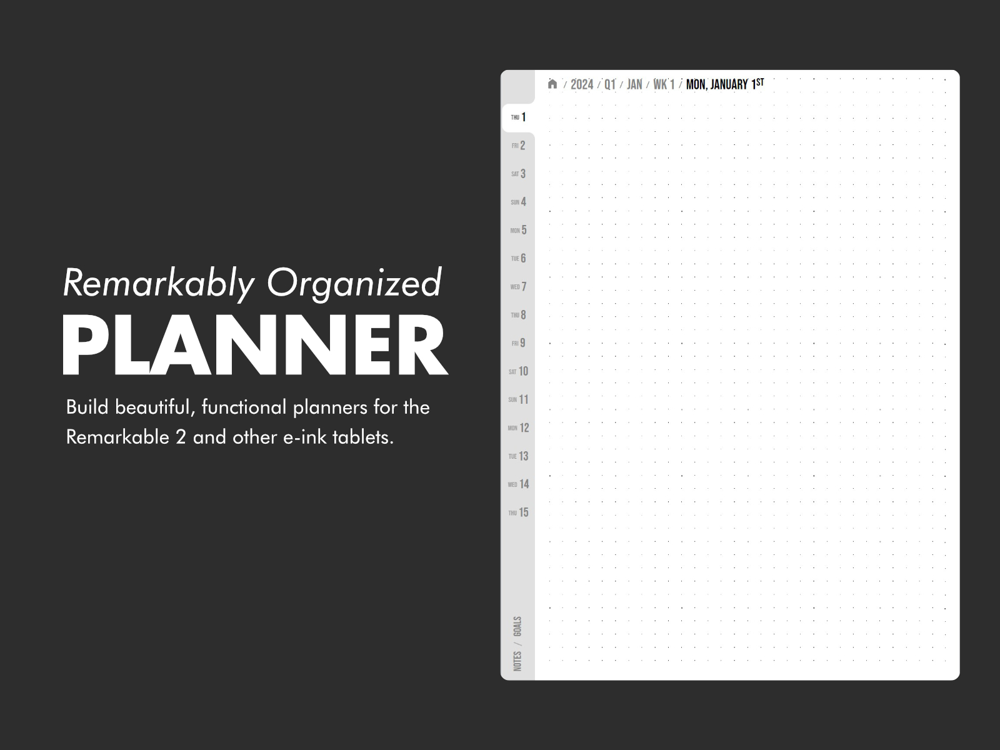
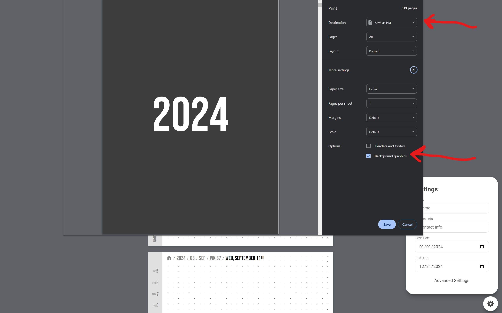

[](https://www.buymeacoffee.com/brianschwabauer)

# Remarkably Organized Planner

A web app for generating customizable planners designed for e-ink tablets like the Remarkable 2.



Use the "settings" modal to change the planner's content & design. The preview of the pdf should be generated live.

The current settings are saved in the URL so a particular planner can be shared easily. Just copy the URL and share with others!

## Exporting to PDF

To get the PDF of the generated planner, use the built in print-to-pdf functionality of Chrome. Make sure "Background Graphics" is enabled.

If the selected settings makes a very large PDF, you might have to use a powerful computer to generate the PDF. It can require a decent amount of memory in Chrome for large PDFs.



## Development

The web app is built using the Svelte framework.
Knowledge of web technologies is required to run this app.
If you don't know what pnpm is, you probably won't understand the code.

Install pnpm, and run the following:
```bash
pnpm i
pnpm run dev
```

This will open up locahost:5173 where the actions can be viewed and tested.

It uses Svelte & Vite under the hood for automatic HMR.

To build the code run,

```bash
pnpm run build
```

## Future Ideas

### Auto linking "Today" button

In the future, there could be a script that runs every day that updates the pdf so that all links to /today would be converted to the actual date (like /2024-1-1).

That way you could always click on a "Today" button to take you to the right page.

Here's a sample command. This command just needs to be run every day once a day.

```bash
 sed -i 's/OLD_TEXT/NEW_TEXT/g' PDF_NAME.pdf
 sed -i 's/\/today/\/2024-1-1/g' PDF_NAME.pdf
```

### Insert events from ICS file

Add an input to add a link to a public ICS file that could pull in events into the calendar.
